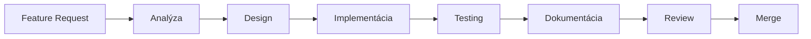

# 🚀 NG-Power-Exams Expansion System

## Prehľad

Tento expansion systém poskytuje štandardizovaný prístup k rozširovaniu aplikácie NG-Power-Exams. Obsahuje šablóny, utility a konfiguračné súbory pre konzistentný vývoj.

## 📁 Štruktúra

```
ng-power-exams/
├── docs/expansion/                  # Dokumentácia
│   ├── EXPANSION_README.md         # Tento súbor
│   ├── ANALYSIS_AND_EXPANSION.md   # Detailná analýza a plány
│   ├── IMPLEMENTATION_GUIDE.md     # Implementačný návod
│   └── QUICK_REFERENCE.md          # Rýchla referencia
│
└── src/lib/expansion/              # Expansion knižnica
    ├── templates/                  # Šablóny kódu
    │   ├── function-template.ts
    │   ├── service-template.ts
    │   ├── component-template.ts
    │   └── interface-template.ts
    ├── utils/                      # Utility
    │   ├── logger.ts
    │   └── error-handler.ts
    └── config/                     # Konfigurácia
        └── expansion-config.ts
```

## 🎯 Účel

### Dokumentácia (docs/expansion/)
- **Komplexná analýza** existujúceho kódu
- **Implementačné návody** pre nové features
- **Best practices** a design patterns
- **Rýchla referencia** pre denné použitie

### Knižnica (src/lib/expansion/)
- **Šablóny** pre konzistentný kód
- **Utility funkcie** pre logging a error handling
- **Konfigurácia** pre expansion nastavenia

## 🚀 Ako začať

### 1. Prečítaj dokumentáciu
```bash
# Začni s quick reference
cat docs/expansion/QUICK_REFERENCE.md

# Potom detailná analýza
cat docs/expansion/ANALYSIS_AND_EXPANSION.md

# Nakoniec implementačný návod
cat docs/expansion/IMPLEMENTATION_GUIDE.md
```

### 2. Použij šablóny
```typescript
// Príklad: Vytvorenie novej utility
import { functionTemplate } from '@/lib/expansion/templates/function-template';

// Použij šablónu pre konzistentný kód
```

### 3. Implementuj features
```bash
# Podľa IMPLEMENTATION_GUIDE.md
# Použij logger a error-handler z utils/
```

## 📚 Dokumentačné súbory

### QUICK_REFERENCE.md
- Rýchly prístup k častým úlohám
- Príklady kódu
- Command reference

### ANALYSIS_AND_EXPANSION.md
- Detailná analýza existujúceho kódu
- Identifikované problémy
- Návrhy riešení
- Expansion plány

### IMPLEMENTATION_GUIDE.md
- Krok-za-krokom implementácia
- Testing stratégie
- Integration guidelines
- Best practices

## 🔧 Expansion knižnica

### Templates
Štandardizované šablóny pre:
- Functions
- Services
- Components
- Interfaces

### Utils
Utility funkcie:
- **Logger**: Štruktúrované logovanie
- **Error Handler**: Centralizované error handling

### Config
Konfiguračné súbory:
- Expansion nastavenia
- Feature flags
- Environment config

## 🎨 Princípy

1. **Konzistencia**: Všetok nový kód používa šablóny
2. **Dokumentácia**: Každá feature má dokumentáciu
3. **Testing**: Všetko má testy
4. **Type Safety**: Plné TypeScript typovanie
5. **Reusability**: Znovupoužiteľné komponenty

## 🔄 Workflow



## 📖 Ďalšie čítanie

- [Angular 19 Signal Store](https://ngrx.io/guide/signals/signal-store)
- [TypeScript Best Practices](https://www.typescriptlang.org/docs/handbook/declaration-files/do-s-and-don-ts.html)
- [Angular Style Guide](https://angular.dev/style-guide)

## 🤝 Prispievanie

1. Prečítaj dokumentáciu
2. Použij šablóny
3. Pridaj testy
4. Aktualizuj dokumentáciu
5. Vytvor PR

## 📞 Podpora

- GitHub Issues: https://github.com/fabianmarian8/ng-power-exams/issues
- Dokumentácia: `docs/expansion/`
- Templates: `src/lib/expansion/templates/`

---

**Verzia:** 1.0.0  
**Posledná aktualizácia:** 2025-10-18  
**Autor:** Marian Fabian
